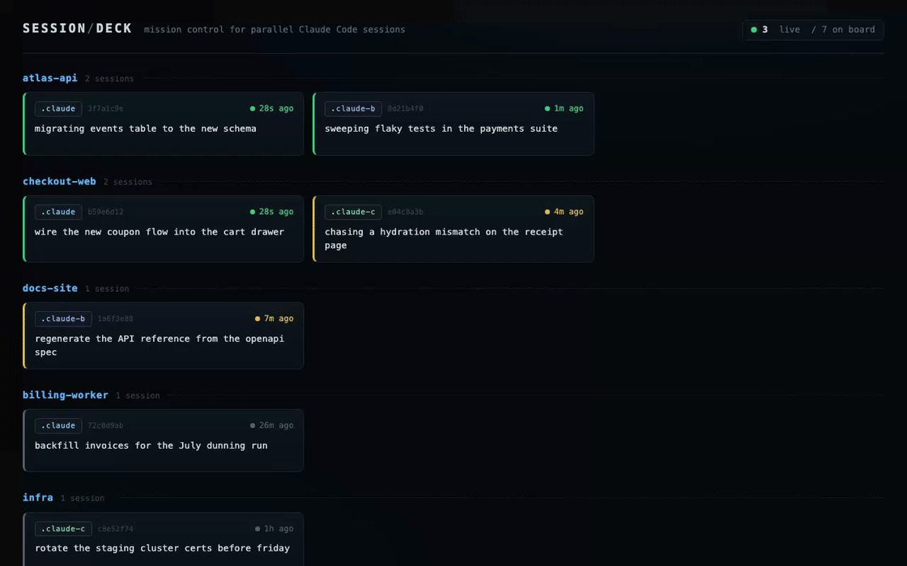

# session-deck

[](https://github.com/dylanpulver/session-deck/actions/workflows/ci.yml)

**Mission control for parallel Claude Code sessions — your agents, on one screen.**



Run three Claude Code sessions at once and they're invisible to each other — and mostly to
you. session-deck is a live local dashboard for the session presence board from
[agent-ops](https://github.com/dylanpulver/agent-ops): one card per live session, grouped by
repo, showing which account it runs under, what it's doing right now, and how fresh it is
(green under 2 minutes, amber under 10, gray stale). Updates stream in over SSE the moment
the board file changes. Zero dependencies — a single Node script, stdlib only.

## Quickstart

```sh
npx github:dylanpulver/session-deck
# ▸ http://localhost:4680
```

Or straight from a clone:

```sh
git clone https://github.com/dylanpulver/session-deck
node session-deck/bin/session-deck.js
```

Over SSH (no browser), print the board as a table instead:

```sh
npx github:dylanpulver/session-deck --once
```

```
  REPO            CFG        SEEN     DOING
● atlas-api       .claude    26s ago  migrating events table to the new schema
● checkout-web    .claude    26s ago  wire the new coupon flow into the cart drawer
● atlas-api       .claude-b  1m ago   sweeping flaky tests in the payments suite
● checkout-web    .claude-c  4m ago   chasing a hydration mismatch on the receipt page
● docs-site       .claude-b  7m ago   regenerate the API reference from the openapi spec
● billing-worker  .claude    26m ago  backfill invoices for the July dunning run
● infra           .claude-c  1h ago   rotate the staging cluster certs before friday
7 sessions · 3 live
```

## Pairing with agent-ops

session-deck renders a board; [agent-ops](https://github.com/dylanpulver/agent-ops) writes
one. Its `hooks/board-register.sh` hook self-registers every Claude Code session — across
all your config dirs and accounts — into `~/.claude-sessions/board.jsonl`, one JSON line
per live session:

```json
{"sid":"<session-uuid>","cwd":"/path/to/repo","cfg":".claude-b","seen":"2026-08-16 14:02","doing":"migrating events table to the new schema"}
```

`SessionStart` registers, `UserPromptSubmit` heartbeats (refreshing `seen` and `doing`),
`SessionEnd` deregisters, and stale rows age off after 24h. Setup:

1. Install the hook — see
   [agent-ops pattern 01](https://github.com/dylanpulver/agent-ops/blob/main/patterns/01-session-board.md).
2. Run `session-deck`. It watches the default board path out of the box; every session
   appears the moment it starts, and its card flashes when its intent changes.

The board is advisory presence, not a lock — session-deck is the human half of that
protocol: the sessions read the file, you read the deck.

## Options

| Flag | Default | What it does |
|---|---|---|
| `--board <path>` | `~/.claude-sessions/board.jsonl` | Board file to watch |
| `--port <n>` | `4680` | Port for the dashboard |
| `--once` | — | Print the board as a table to stdout and exit |
| `-h`, `--help` | — | Show usage |

Malformed board lines (torn concurrent writes) are skipped silently; a missing board file
gets a friendly pointer to the agent-ops setup instead of a stack trace.

## Development

```sh
npm test   # node:test, zero dev-dependencies either
```

## Siblings

- [agent-ops](https://github.com/dylanpulver/agent-ops) — the operating patterns (and the
  hook) this dashboard visualizes.
- [claude-skills](https://github.com/dylanpulver/claude-skills) — a governed skills setup
  for Claude Code.

## License

[MIT](LICENSE)
